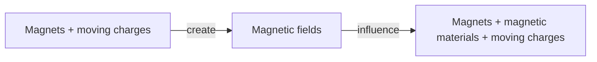

## 2026-02-11

**Electrostatics**: No charges flowing
**Electrodynamics**: Flowing charge carriers

**Current** $i$: The amount of charge that passes through a surface every second $C/S$, a.k.a. amperes

**Current density** $J$: Current per unit area
$$ i = arrow(J) dot arrow(A) $$

---

$i = n_e e v_d A$
$J = n_e e v_d$
$J = sigma E$
$rho = 1 / sigma$

$$ i = sigma E A = (E A) / rho = (Delta V A) / (L rho) = (Delta V) / R $$

**Conductivity** $sigma$
**Resistivity** $rho$

**Drude model**:
$$ sigma = (n e^2 tau) / m $$

$$ v_d = (e E tau) / m $$

$$ R = rho L/A $$

$I$ = conventional current
$i_e$ = electron current

---

Magnets interact with other magnets and magnetic materials.
Magnets also influence **moving** charges.

Magnets have 2 poles: North & South
Opposite poles attract

North pole seeks Earth's magnetic North pole -> it is actually a South pole...

North and South *always* come in pairs -> the magnetic dipole is the fundamental unit -> **no magnetic monopoles**

Magnetic field likes are continuous, unlike electric dipoles (where field lines start and stop at charges).

## 2026-02-13

**Kirchhoff's Junction Rule**: All the current that enters a junction exits that junction.

$arrow(B)$: Magnetic field (Tesla)

Field lines extend from the North pole to the South pole.

**Gauss's Law for magnetism**: The flux through a Gaussian surface over a magnet is always 0.
$$ integral.cont arrow(B) dot d arrow(A) = 0 $$

**Biot-Savart Law**:
$$ arrow(B) = mu_0 / (4 pi) dot (q arrow(v) times arrow(r)) / r^2 $$

$mu_0$: Permittivity of free space

Note: $1 / sqrt(epsilon_0 mu_0) = C$

**Right-hand current rule**: Thumb in direction of conventional current, fingers curl in direction of $arrow(B)$.

$$ arrow(B) = (mu_0 I) / (2 pi r) $$

---

A single loop of current looks almost like a squashed bar magnet. Therefore, a stacked coil of loops emulates a bar magnet.
The loop has a dipole moment: $arrow(m) = I A$