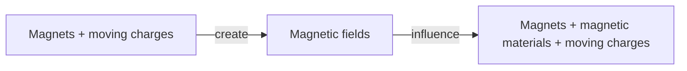

## 2026-02-11

Magnets interact with other magnets and magnetic materials.
Magnets also influence **moving** charges.

Magnets have 2 poles: North & South
Opposite poles attract

North pole seeks Earth's magnetic North pole -> it is actually a South pole...

North and South *always* come in pairs -> the magnetic dipole is the fundamental unit -> **no magnetic monopoles**

Magnetic field likes are continuous, unlike electric dipoles (where field lines start and stop at charges).